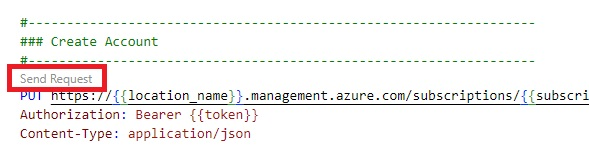

# Control Plane and Data Plane E2E Testing for Build 2025 

This repo has the following files

| File     | Details  |
|----------|----------|
| [Control plane Tests](control-plane-tests.http)    | REST API calls to create, list and get accounts, projects, connections and deployments in the FDP resource (aka 1RP)|
| [Data plane tests](data-plane-tests.http)    | REST API Calls for data plane. This file will be updated with more cases as they become available|
| UI testing| Use [int.ai.azure.com?flight=FDP](https://int.ai.azure.com?flight=FDP) to test UI features|

## Setup VS Code

* Clone this repo
* Open in VS Code
* Install the [REST Client](https://marketplace.visualstudio.com/items?itemName=humao.rest-client)

## Using .http files

* Open the .http file
* Replace the variables (@variable_name) with appropriate values
* Click on send request

## Common Pre-reqs

* You will need an azure subscription and a resource group
* You will need to be allow-listed to create accounts and projects in Canary (eastus2euap). Check this [onenote](https://microsoft.sharepoint.com/teams/Vienna/_layouts/15/Doc.aspx?sourcedoc=%7B7ebf9ccd-fa20-4e82-8b2b-6c14c9f1740f%7D&action=edit&wd=target%28Engineering%2F1FoundryType.one%7C2b247bc6-d116-40be-994f-6e42405497dc%2FCreate+account+%28aka+virtual+hub%5C%29%7C7c3c9783-2e3c-4d9e-aa06-01cf80d78c00%2F%29&wdorigin=703) on how to get allow listed

## Control Plane Testing

* Open the [control-plane-tests.http](control-plane-tests.http) file in VS Code
* Replace the variables (@variable_name) with appropriate values
* Run tests for as many cases as possible in the file

## Data Plane Testing

* Open the [data-plane-tests.http](data-plane-tests.http) file in VS Code
* Replace the variables (@variable_name) with appropriate values
  * Currently we are using API Keys as a workaround for data plane - this will be replaced by Entra ID soon
  * To get the API Key open the account you created in Control Plane in the azure portal and copy the keys
* Run tests for as many cases as possible in the file

## Raise Bugs

* Use the [aka.ms/fdpbug](https://aka.ms/fdpbug) bug template to log bugs

## Common Accounts to be reused (not recommended)

We would recommend to create your own account in your sub for testing. However, in case of difficulties you can use the following common account for testing:

* subscription_id = e460f5d7-8e5c-4987-b15d-6cd8b7970ede
* resource_group = balapv-canary-rg
* account_name = build2025-test-account1
* project_name = project1
* location_name = eastus2euap
* api_key = Ask balapv@microsoft.com (useful for Data plane testing only)